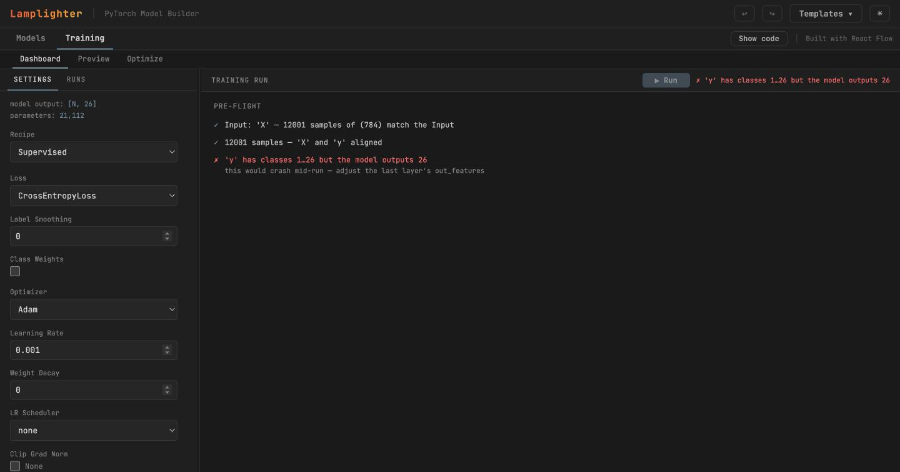

# Lamplighter

**Pre-flight checks for PyTorch training runs.**

[](https://github.com/scott-kirila/Lamplighter/actions/workflows/ci.yml)
[](https://pypi.org/project/lamplighter/)


Lamplighter reads your **actual data** against your **actual model** and tells
you what will go wrong — the label off-by-one, the softmax stacked under
`CrossEntropyLoss`, the final batch of one sample meeting a `BatchNorm`, the
pretrained backbone getting raw pixels — *before* you spend the epoch. It runs
inside your Jupyter kernel, so your data never moves.



> Above: EMNIST's `letters` split returns labels in **1…26**, not 0…25 — a real
> torchvision gotcha. A 26-output head with `CrossEntropyLoss` will assert and
> die mid-epoch with an opaque CUDA error. Lamplighter says so at the door, in
> plain English, and holds ▶ Run until it's fixed. `1…26` is the actual min and
> max of the tensor you registered — arithmetic, not a heuristic.

## Install

```bash
pip install lamplighter          # or: uv add lamplighter
```

Python ≥ 3.12. That's everything — the UI ships inside the wheel, so there's no
Node toolchain to install. (torch is a large dependency; a CPU-only environment
can `pip install lamplighter --extra-index-url https://download.pytorch.org/whl/cpu`.)

## Three lines, no browser

`check()` takes the objects you already have and reads them directly:

```python
import lamplighter
from torch import nn

report = lamplighter.check(model, (X, y), loss=nn.CrossEntropyLoss())
print(report)   # ✗/⚠/✓ rows — each finding with its fix
report.ok       # False until the errors are gone; gate your run on it
```

`data` can be an `(X, y)` pair, a bare tensor, a `Dataset`, an HF-style dict
of tensors, or your `DataLoader` — whose real `batch_size`/`drop_last`
arithmetic is checked too. The model can be anything that is an `nn.Module`:
hand-written, generated, HuggingFace. `check()` never traces it — it walks
`named_modules()` and runs **one real forward pass** (eval mode, `no_grad`,
training mode restored), so what gets checked is what actually runs: an
`F.softmax` hiding inside `forward()` is invisible to every static reviewer
and caught here behaviourally, because the output rows sum to 1.

## For coding agents (MCP)

The model that wrote your training loop is the worst reviewer of it. The MCP
server gives any agent a verdict computed from the real tensors instead:

```bash
pip install "lamplighter[mcp]"
claude mcp add lamplighter -- python -m lamplighter.mcp
```

One tool, `check_training`: the agent sends a few lines of setup (import or
build `model`, `data`, `loss` — typically from your own project), the server
runs them in a fresh subprocess and returns the report as JSON. A fragment
for your `CLAUDE.md` / `AGENTS.md` so agents call it unprompted:

```markdown
Before starting any PyTorch training run — and after changing the model,
data pipeline, loss, or batch size — call the lamplighter `check_training`
tool and fix every error it reports. Several of the failures it catches
raise no exception at all; passing tests do not cover them.
```

The setup code executes for real (same trust level as the agent's shell), in
whatever interpreter you point `python=` at — that environment needs torch,
not lamplighter.

## The app: build, check, and train in the browser

```python
import lamplighter
lamplighter.demo()   # opens the browser on a CNN + MNIST — press ▶ Run
```

Or bring your own data:

```python
import lamplighter
sess = lamplighter.Lamplighter()   # a server in this kernel — no browser yet
sess.data(X=X, y=y)                # hand it references, not copies
sess.open()                        # open the editor; pick X/y, pick a loss
# The Pre-flight panel checks your tensors against your model as you go.
# When it's green, press ▶ Run — curves stream live; the trained model is here:
sess.model                         # the trained nn.Module
sess.history                       # per-epoch metrics, ready to plot
```

A worked example that catches a real bug is in
[`examples/verify.ipynb`](examples/verify.ipynb).

## "Why not just ask an LLM to write it?"

Do. It writes a good training loop.

What it cannot do is look at your data. It doesn't know your labels run 1…10
while your last layer emits 10 logits, that `y` is a float `(N, 1)` column when
`CrossEntropyLoss` wants 1-D longs, that 50,000 samples at `batch_size=7` leaves
a final batch of one and your model contains a `BatchNorm1d`, or that the
`resnet18` it dropped in wants ImageNet normalization and is getting raw `[0,1]`.
None of those is a syntax error, a type error, or a failing unit test. Each one
either crashes forty minutes in or — worse — trains to a number that means
nothing. Lamplighter checks them against your real tensors before the run.

The more of your PyTorch a machine writes, the more this matters.

## What it checks

Every check runs against the objects you registered — real shapes, real dtypes,
real class ranges — not a description of them. Among them:

- **Class indices vs. output width** — labels `1…26` into a 26-logit head is the
  mid-epoch CUDA assert, caught at the door.
- **Loss ↔ target fit** — `CrossEntropyLoss` on a softmax head (double softmax),
  `NLLLoss` without a `LogSoftmax`, float targets where longs are wanted.
- **Batch-size traps** — a final ragged batch of one sample meeting a
  `BatchNorm` (`12001 % 40 = 1`), which crashes only sometimes and only late.
- **Shape & dtype fit** — `X` against the Input, `X`↔`y` sample alignment,
  integer-index inputs into an `Embedding`.
- **Pretrained-backbone hygiene** — a torchvision backbone fed unnormalized
  input, or the wrong resolution.
- **Causal-LM leakage** — self-attention that isn't masked, so the model trains
  on the answer and reports a perplexity that describes nothing.
- **Behavioural probes** (headless `check()`) — NaN/Inf in the outputs before
  any training step, a `view`/`reshape` that folds the batch dimension, an
  output that is secretly probabilities (any softmax, however hidden), and
  causal masking verified by perturbing future tokens and watching past
  logits — which works on flash attention, where nothing is structurally
  visible.

The checks are a plain function — `lamplighter.check()` headless, `diagnose.py`
behind the canvas — and the canvas is just where they show. You can call them
from the notebook too (see `examples/verify.ipynb`).

## Bring a model you already have

Most models don't start from a blank canvas — they come from a paper repo, a
colleague, or an agent. `sess.inspect` traces an existing `nn.Module` onto the
canvas so you can check it, and — because the generated code is seeded with the
model's original weights — **run it**, not just look at it:

```python
import torchvision.models as models
sess.inspect(models.resnet18(), input_shape=(1, 3, 224, 224))
# ✓ imported ResNet as 'ResNet18' — 71 nodes
#   ▶ ready to run — open the app and press Run to fine-tune it.
```

Fidelity is never faked. An imported model round-trips to *numerically
identical* output (verified across the resnet family at maxdiff `0`), and any
layer the canvas can't represent exactly is drawn as an **Opaque** node — a
labelled hole — rather than a confidently-wrong one. A model that's mostly
tensor bookkeeping (a transformer) is reported and refused, not drawn as a
hundred holes. What you see is what will run.

## Build one from scratch, too

You don't have to import. Assemble an `nn.Module` by wiring nodes on a canvas,
with shapes inferred live (on PyTorch's meta device, so it's free), invalid
wiring flagged in place, and a parameter count shown with its arithmetic. Start
from a built-in **template** (MLP, CNN, transformer, GAN, cGAN, VAE) — each a
complete, pre-wired project held green by the test suite.

Build **several** models and train them together under a declarative **recipe**:
a GAN's generator and discriminator train in tandem, a VAE's encoder and decoder
under one optimizer — in-app.

Every tab's **Show code** button reveals the exact `nn.Module`,
`make_dataloaders()`, and `train()` it drives, and the Run button executes those
same sources — seed included — ready to copy straight out. Nothing runs that you
can't read.

## Nodes

| Category    | Nodes |
|-------------|-------|
| I/O         | Input, Output |
| Layers      | Linear, Embedding, Conv1d/2d/3d, MaxPool1d/2d, AvgPool2d, AdaptiveAvgPool2d, AdaptiveMaxPool2d, Flatten, Dropout, Dropout2d, BatchNorm1d/2d, LayerNorm, GroupNorm, InstanceNorm2d, RNN, LSTM, GRU, Self-Attention, Transformer Block, Pretrained Backbone (resnet/mobilenet/efficientnet/densenet), **Custom Module** (any `nn.Module` from your notebook, via `sess.modules(...)`) |
| Activations | ReLU, Sigmoid, Tanh, LeakyReLU, GELU, ELU, SiLU, Softmax |
| Ops         | Concat, Add (residual/skip connections), Reshape, Permute, Mean (sequence pooling) |

Nodes are declarative registry data (`lamplighter/backend/registry.py`) — adding
a layer is one `NodeDef`; shape inference and code generation are generic over it.

## Recipes

| Recipe | Roles | What it trains |
|--------|-------|----------------|
| Supervised | model | The classic loop: loss + optimizer over `(X, y)`, optional validation split and accuracy. |
| GAN (adversarial) | generator, discriminator | Alternating discriminator/generator steps (BCE on the real/fake decision); reports `g_loss`/`d_loss`. Latent noise is drawn to the generator's Input shape. |
| Conditional GAN | generator, discriminator | A GAN whose class label conditions both models — the dataset's `y` feeds each model's `label` port, so you can generate a *chosen* class. |
| VAE (autoencoder) | encoder, decoder | Joint training with one optimizer: encode → reparameterize → decode, reconstruction + `beta`·KL. Reports `recon_loss`/`kl_loss`. |

Recipes are declarative too (`lamplighter/backend/recipes.py`) — a recipe is
roles + form params + a data contract + one `generate(project)` that emits the
`train()`. The runner and Training-tab form are generic over it, so adding a loop
is one `RecipeDef`, never a branch in an engine. (Reinforcement-learning recipes
ship in the optional `lamplighter[rl]` extra; hyperparameter sweeps in
`lamplighter[sweep]`.)

## Notebook API

| Call | Description |
|------|-------------|
| `lamplighter.check(model, data, loss=...)` | Pre-flight any `nn.Module` against real data — headless, no session; returns a report with `.ok`. |
| `lamplighter.Lamplighter(...)` | Start (or reuse) a session; returns it. |
| `lamplighter.demo()` | One cell to a running CNN + MNIST, no data of your own. |
| `sess.data(X=X, y=y)` | Register data references by name — merges across calls; re-register to repoint. |
| `sess.inspect(model, x)` | Trace an existing `nn.Module` onto the canvas, seeded with its weights so you can run it. |
| `sess.model` / `sess.models` | The trained model(s) from the last run. |
| `sess.best_model` | The model at the lowest-validation-loss epoch (often better than the final one). |
| `sess.history` / `sess.snapshot` | Per-epoch metrics; the full reproducibility record (seed, device, configs, exact sources). |
| `sess.save_checkpoint("m.pt")` / `lamplighter.load_checkpoint(path)` | Save/reload weights + snapshot as one self-contained file — no session needed. |
| `sess.resume("name", epochs=None)` | Continue a stored run toward (or past) its planned epoch target. |
| `lamplighter.diagnostics()` | Versions, devices, and installed extras — paste this into a bug report. |
| `build_model()` / `build_dataloaders()` / `build_trainer()` | The generated pieces, to own the loop yourself. |

Prefer owning the loop? The generated pieces compose exactly like the Run button:

```python
model = lamplighter.build_model()
train_loader, val_loader = lamplighter.build_dataloaders()(X, y)
history = lamplighter.build_trainer()(model, train_loader, val_loader=val_loader)
```

More examples: an MNIST classifier ([`example.ipynb`](examples/example.ipynb)), a
GAN ([`gan.ipynb`](examples/gan.ipynb)), a conditional GAN
([`cgan.ipynb`](examples/cgan.ipynb)), a VAE ([`vae.ipynb`](examples/vae.ipynb)),
and a hyperparameter sweep ([`optuna.ipynb`](examples/optuna.ipynb)).

## Architecture

Three parts, all local, one port:

- **Backend** (`lamplighter/backend/`) — FastAPI on a daemon thread *inside* the
  kernel. Holds the project, infers shapes on the meta device, generates all
  source, keeps the data registry (name → reference), runs the pre-flight
  diagnostics, and executes training runs on a background thread with per-epoch
  progress over a WebSocket.
- **Frontend** (`frontend/`) — React + [xyflow](https://reactflow.dev): the
  canvas, the Pre-flight panel, the Training dashboard, light/dark themes.
- **Client** (`lamplighter/`) — the notebook API and session lifecycle.

The project is autosaved to `.lamplighter/graph.json` and restored on start, so
a kernel restart loses neither the project nor your named checkpoints.

## Security model

The server binds `127.0.0.1` and carries **no authentication** — it sits beside
the kernel it drives, reachable only from your machine. Because a browser can
reach that port on behalf of any page you visit, Lamplighter also checks the
`Origin` of every WebSocket and the `Host` of every request, and answers only to
loopback. For a remote kernel, use the SSH tunnel `sess.open()` prints. Loading a
checkpoint executes the model's stored source, so only load ones you trust. See
[`SECURITY.md`](SECURITY.md).

## Development

```bash
uv sync                          # Python dependencies
uv run pytest                    # backend tests
cd frontend && npm install && npm run build && npm test
```

The backend serves the built `frontend/dist/`, so after editing frontend source
run `npm run build` and hard-refresh; backend edits need a kernel restart. See
[`CONTRIBUTING.md`](CONTRIBUTING.md) for the one architectural rule.
